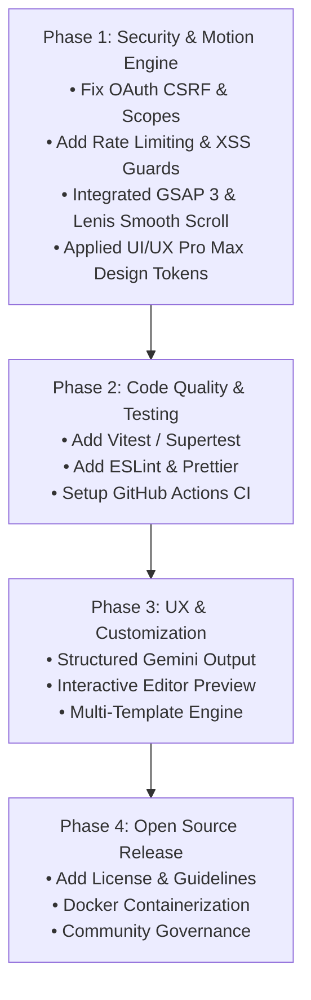

# Portfol.io — Public Resource & Open Source Readiness Blueprint

This document provides a comprehensive analysis of **Portfol.io** and details actionable recommendations to transform the codebase into a production-grade, secure, scalable, and community-friendly open-source public resource.

---

## Executive Summary

**Portfol.io** is a high-value tool that converts user resumes (PDF/DOCX) into customized, single-page portfolio websites using AI (Google Gemini) and deploys them directly to GitHub Pages. 

While the core functionality is functional and well-conceived, several critical areas must be addressed before releasing or marketing it as a public resource:
1. **Security & Auth Vulnerabilities** (CSRF, broad OAuth scopes, missing rate limits, XSS risks).
2. **Architectural Bottlenecks** (in-memory state storage, dead code files, hardcoded models).
3. **User Experience & Customization** (lack of pre-deployment editing, template selection).
4. **Developer Experience & Operations** (missing tests, Docker containerization, CI/CD pipelines).
5. **Open Source Governance** (missing License, Contributing guidelines, Security policy).

---

## 1. Security & Data Protection

| Issue | Risk Level | Description & Mitigation |
| :--- | :---: | :--- |
| **OAuth State & CSRF** | 🔴 High | `server.js` uses `state: sessionId` without cryptographic random nonce verification, making OAuth flows susceptible to CSRF attacks. <br>**Fix:** Implement session cookies or signed JWTs for OAuth `state` validation. |
| **Over-Privileged OAuth Scope** | 🔴 High | The app requests `scope: "repo user"`, granting full read/write access to all public and private user repositories. <br>**Fix:** Downgrade scope to `public_repo` (or leverage fine-grained GitHub App tokens). |
| **Missing Rate Limiting** | 🔴 High | Public `/generate` endpoints accept file uploads and invoke paid/rate-limited Gemini APIs without protection against abuse or DoS. <br>**Fix:** Add `express-rate-limit` (e.g., 5 generations per IP per hour). |
| **File Upload Vulnerabilities** | 🟡 Medium | `multer` writes uploaded files to disk before checking extensions, and relies only on extension matching rather than MIME/magic byte validation. <br>**Fix:** Use `multer` memory storage or strict `fileFilter` validating magic numbers. |
| **Template XSS Risk** | 🟡 Medium | Resume content extracted by AI is injected directly into HTML string templates in `generator.js` without HTML escaping. <br>**Fix:** Sanitize/escape all dynamic variables before rendering HTML templates. |
| **Permissive CORS** | 🟡 Medium | `app.use(cors())` enables wildcard CORS origins. <br>**Fix:** Restrict allowed origins via environment configuration in production. |

---

## 2. Architecture & Backend Robustness

- **In-Memory Session Store (`portfolioStore = new Map()`)**
  - *Current Problem:* Sessions are stored in server memory. Restarting the server or deploying behind a multi-instance load balancer / serverless host (Render, Vercel, Railway) breaks GitHub deployment callbacks.
  - *Improvement:* Replace `portfolioStore` with stateless encrypted JWTs/cookies or a lightweight Redis store.
- **Dead Code Cleanup (`src/deploy.js`)**
  - *Current Problem:* `src/deploy.js` is empty (0 bytes) despite being documented in `README.md`.
  - *Improvement:* Modularize GitHub deployment logic out of `server.js` into `src/deploy.js`.
- **Gemini API & AI Resilience**
  - *Current Problem:* Hardcoded model string `gemini-2.5-flash` in `src/ai.js`, prompt parsing relies on string regex fallback, and there is no API retry/fallback logic.
  - *Improvement:*
    - Make model configurable via `GEMINI_MODEL` env variable (defaulting to stable versions like `gemini-1.5-flash` or `gemini-2.0-flash`).
    - Use Gemini's native `responseSchema` / structured output feature for guaranteed JSON responses.
    - Implement automatic retry with exponential backoff for AI service calls.

---

## 3. Frontend & User Experience (UX/UI)

- **Interactive Pre-Deployment Customization**
  - Allow users to edit generated text, toggle color palettes, modify experience order, or upload project preview thumbnails before deploying.
- **Multiple Portfolio Templates**
  - Expand beyond the single layout template in `generator.js` to offer choices (e.g., *Minimalist*, *Creative*, *Developer-Focused*, *Executive*).
- **Deployment Progress Feedback**
  - Replace immediate server-side HTTP redirects with real-time UI progress indicators (e.g., "Authenticating with GitHub → Creating repository → Publishing to GitHub Pages").
- **Accessibility & Custom Domains**
  - Ensure generated HTML satisfies WCAG AA contrast standards.
  - Provide guidance and UI controls for configuring custom domain names (`CNAME`) on GitHub Pages.

---

## 4. Developer Experience & Quality Assurance

- **Automated Testing Suite**
  - Add unit tests for resume extraction (`src/extract.js`), template generation (`src/generator.js`), and route integration tests using **Jest / Vitest** and **Supertest**.
- **CLI Enhancement**
  - Extend `index.js` CLI tool to support a `--deploy` flag and interactive prompts (`inquirer`), matching web feature parity.
- **Docker & Containerization**
  - Add a production `Dockerfile` and `docker-compose.yml` to simplify self-hosting and local development.
- **Static Analysis & Tooling**
  - Add ESLint, Prettier, and Husky pre-commit hooks to maintain code consistency across open-source contributions.
- **CI/CD Workflows**
  - Add `.github/workflows/ci.yml` for automated linting, dependency auditing, and test suites on Pull Requests.

---

## 5. Open Source Standards & Documentation

- **Missing Legal & Community Files**
  - [ ] Add `LICENSE` file (MIT License recommended).
  - [ ] Add `CONTRIBUTING.md` with guidelines for pull requests, bug reporting, and setup.
  - [ ] Add `CODE_OF_CONDUCT.md` (Contributor Covenant).
  - [ ] Add `SECURITY.md` detailing vulnerability reporting procedures.
  - [ ] Add GitHub Issue & PR templates (`.github/ISSUE_TEMPLATE/`).
- **Package Metadata**
  - Update `package.json` with repository URL, author info, keywords, homepage link, and appropriate license identifier.

---

## 6. Integration of Specialized Design & Motion Engines (UI/UX Pro Max, GSAP, Lenis)

To elevate generated portfolios from static templates to premium, interactive web applications, the generator incorporates three core design & animation skills:

```
┌─────────────────────────────────────────────────────────────────────────────┐
│                       PORTFOLIO GENERATION ENGINE                           │
├─────────────────────────┬───────────────────────────┬───────────────────────┤
│    UI/UX Pro Max        │          GSAP 3           │        Lenis          │
│  (Design Intelligence)  │     (ScrollTrigger)       │  (Smooth Scrolling)   │
├─────────────────────────┼───────────────────────────┼───────────────────────┤
│ • HSL & RGB tokens      │ • Entrance timelines      │ • Inertia scroll RAF  │
│ • Glassmorphism styles  │ • Scroll-driven reveals   │ • ScrollTrigger sync  │
│ • Accessible contrast   │ • Staggered item entry    │ • Smooth anchor links │
│ • Responsive scales     │ • Magnetic hover buttons  │ • Reduced motion honor│
└─────────────────────────┴───────────────────────────┴───────────────────────┘
```

1. **UI/UX Pro Max (Design Intelligence System)**
   - Dynamic design token variables (`--primary`, `--accent`, `--surface`, `--border`) derived from Gemini AI theme generation.
   - Glassmorphic navigation headers with backdrop filters and progress tracking indicators.
   - Responsive micro-interactions, custom scrollbar styling, and high-contrast light/dark mode pairings.

2. **GSAP 3 & ScrollTrigger (Animation Engine)**
   - **Hero Entrance:** Timeline-based staggered entrance sequence for hero text, tagline, and call-to-action buttons (`gsap.timeline`).
   - **Scroll Reveals:** Intersection-aware scroll-triggered element reveals (`ScrollTrigger`) for experience timelines and project cards.
   - **Interactive Physics:** Magnetic button hover response using `gsap.quickTo` for smooth mouse tracking.
   - **Accessibility:** Automatic detection of `prefers-reduced-motion` to immediately reveal content without animation for sensitive users.

3. **Lenis Smooth Scroll (Inertia Scroll Engine)**
   - Silky smooth wheel scrolling powered by `Lenis` requestAnimationFrame (`raf`) tied directly to GSAP's ticker (`gsap.ticker.add`).
   - Frictionless anchor navigation (`#about`, `#projects`, etc.) smoothly scrolling to targets with offset padding.

---

## Roadmap & Implementation Phases


\
---

## Recommended Action Plan

1. **Immediate (Security & Bugs):** Add rate limiting, narrow GitHub OAuth scope to `public_repo`, sanitize HTML output against XSS, and populate `src/deploy.js`.
2. **Short Term (DX & Testing):** Add `LICENSE`, setup unit testing with `vitest`, and configure GitHub Actions CI.
3. **Medium Term (Feature Expansion):** Support multiple design themes and interactive preview adjustments prior to deployment.

